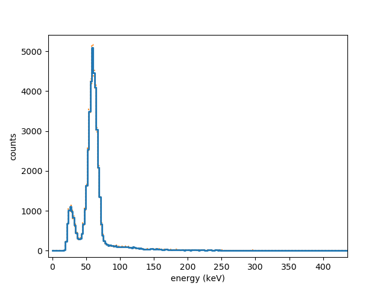

Gamma Lab
=========

Python toolkit for soundcard gamma spectroscopy.


   
   Spectrum of Am-241 acquired with a CsI(Tl) scintillation detector and Gamma Lab

Introduction
------------

This package is a Python package  for the acquisition and analysis of 
soundcard data, specifically for gamma spectroscopy kits that use a 
soundcard as their ADC interface. It consists of independent building 
blocks ("services") that can be connected and reconfigured to form 
different analysis pipelines. Examples of this are included in the 
repository in the *examples* directory.

Prerequisites
-------------

You need at least:

- Python 2.7 or 3.6 or later,
- numpy
- pyaudio

and recommended is:

- matplotlib

Installation
------------

Easiest is to use pip::

  pip install GammaLab

Usage
-----

An example application that acquires data and plots a gamma spectrum is 
included, you can get help::

  ./gammalab-histogram.py --help

This provides only a limited preview of the possibilities that the Gamma 
Lab offers. You can compose your own applications, examples of this are in 
the *examples* directory.

More details
------------

The applications consist of components "services" that are connected with 
"wires." For a component to be included it needs to be imported and 
instantiated, for example you almost always need::

  from gammalab.acquisition import Soundcard
  soundcard=Soundcard()

After instantiating additional components, say::

  from gammalab.backend import SaveRaw
  save=SaveRaw()

they need to be "wired"::

  soundcard.plugs_into(save)

At the moment, components can have one input and one output, but an output 
can be connected to multiple components. When all components are wired, you 
start the pipeline::

  main(timout=100)

The time-out is optional. The application will run until <enter> is pressed 
or until the time-out reached.

The following services are available::

  from gammalab.acquisition import SoundCard
  from gammalab.acquisition import Noise
  from gammalab.transform import Raw2Float
  from gammalab.transform import DownSampleMaxed
  from gammalab.transform import Identity
  from gammalab.analysis import PulseDetection
  from gammalab.analysis import Histogram
  from gammalab.analysis import Count
  from gammalab.backend import Playback
  from gammalab.backend import Monitor
  from gammalab.backend import SaveRaw
  
Note that most of these provide rudementary implementations and are open to 
improvement.  

Development
-----------

It is not difficult to program additional services.

A service is a class with at least the methods: ``start`` ``stop`` and 
``close``. A service which accepts input should instantiate a "wire" 
class defining its input and have connect_input and receive_input methods 
(normally taken care of by deriving from ReceivingService class). If it 
generates output, the service should have an output_protocol method, which 
checks the input wire format and propagates any additional information to 
the wire. It also needs to have some methods normally implemented by 
deriving from the SourceService class (notably the ```plugs_into``` 
method). 

Services start up a seperate thread to do their computations. This could 
also be using some other package's thread (e.g. for soundcard acquisition 
pyaudio's callback thread is used).

The simplest example of a service with input and output is the following::

  class Identity(ThreadService, SourceService, ReceivingService):
      def __init__(self):
         super(Identity, self).__init__()
         self.input_wire=RawWire()
         
     def output_protocol(self, wire):
         assert isinstance(wire, RawWire)
         wire.CHANNELS=self.input_wire.CHANNELS
         wire.RATE=self.input_wire.RATE
         wire.FORMAT=self.input_wire.FORMAT

      def process(self, data):
         return data

This service just forwards the input data (a raw byte stream) to its output,
retaining its sample rate, format and number of channels.In this case the 
necessary ``start`` etc methods are provided by inheritance from 
ThreadService.

